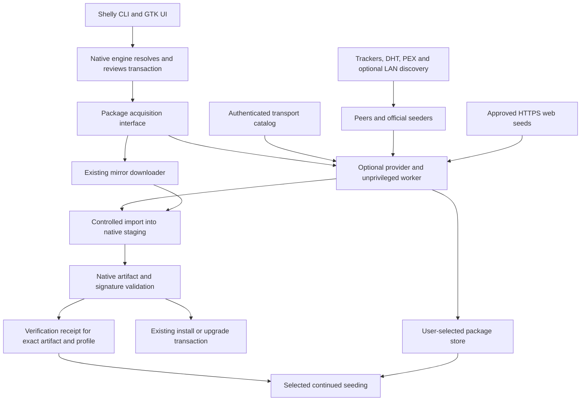

# Shelly torrent plugin proposal

**Status: proposal for discussion; not implemented.** 7 October 2026.

## Current situation / problem

During the early days of CachyOS, I saw how expensive package infrastructure can
be. Servers, mirrors, storage, and bandwidth all have to be paid for by
somebody.

Mirrors spread the load, but they need maintenance and can become slow,
outdated, or unavailable. The best mirror can change with your location, ISP, or
VPN, which may mean testing and ranking mirrors again. [Arch mirror
status](https://archlinux.org/mirrors/status/), [mirror
ranking](https://xyne.dev/projects/reflector/)

When a popular update arrives, many users download exactly the same package. I
want those users to be able to help distribute it, so growing demand can also
bring more upload capacity.

**My main goal is to reduce repository and mirror traffic and costs.** Faster
downloads and better availability would be additional benefits.

## Proposed solution

Add an **optional Shelly plugin using libtorrent**. It would download package
pieces from peers, official seeders, and compatible HTTPS mirrors together.
Shelly would evaluate useful sources while downloading. Libtorrent already
provides the BitTorrent transport and compatible HTTP web seeds. [Libtorrent
HTTP seeding](https://www.libtorrent.org/manual-ref.html#http-seeding)

This should work during **normal installs and upgrades from the first version**.
Shelly would still resolve dependencies, review the transaction, verify
packages, and install them.

### How it would work

- **Repository torrents:** one current multi-file torrent per repository,
  architecture, and channel. For example, `core`, `extra`, and `multilib` would
  have three current descriptors. Users select packages inside them; downloading
  Firefox does not require downloading the whole repository.
- **Automatic updates:** Shelly follows repository updates while active. Changed
  package sets get new torrents; Shelly joins them and checks and reuses
  unchanged archives. Retaining older versions may require keeping older
  torrents.
- **Original packages and trust:** preserve archive bytes, signatures, and
  attribution. Authenticate the package-to-torrent mapping and retain native
  signature verification. Repository owners publish trusted metadata; seeders
  provide bandwidth.
- **Dedicated storage:** users choose a directory and the repositories or
  packages they want to seed. Seeding another distribution's packages must not
  enable its repositories for installation. Arch, CachyOS, Devario, and custom
  repositories have separate identities; incompatible formats need adapters.
- **User control:** downloads may upload checked pieces before full package
  verification. Continued seeding defaults off; keeping it running after closing
  Shelly requires an explicitly enabled service. Provide bandwidth, storage, and
  battery controls.
- **Reliable sources:** keep mirrors and persistent seeders available for
  packages with few peers. Hybrid is the default when P2P is enabled; also offer
  Prefer P2P, P2P only, and Mirror only. P2P only must never silently switch to
  mirror payloads. Use configurable trackers, DHT, PEX, and optional LAN
  discovery.

Seafoam could run trackers and geographically distributed seeders. Independent
repositories should be able to use their own infrastructure without depending on
Seafoam.

### Why a plugin?

Follow Shelly's [optional Flatpak backend approach](flatpak-backend-abi.md).
Keep libtorrent, discovery, and seeding management in the optional component so
the base Shelly build can keep working without them. We still need to agree how
the plugin connects to native package downloads; the Flatpak interface alone
does not provide that connection.

### Review priorities

Maintainer review should cover the download integration, how packages are linked
to trusted torrents, and sharing controls—especially how uploading stops for a
completed or rejected package. Then test ordinary installs and upgrades, and
measure whether the design actually reduces repository and mirror traffic and
costs.

[Implementation details](#implementation-details) ·
[Native libtorrent APIs](#native-libtorrent-apis) ·
[Compatibility notes](#libtorrent-compatibility-notes).


## Implementation details

The requirements below define the proposed backend; they are not implemented
behavior or passed runtime tests. No cost or performance baseline has been
measured. `shelly-torrent-backend` and the optional `shelly-p2p` service are
working names.

Jump to: [integration](#proposed-component-boundary) ·
[trust](#package-authenticity-and-attribution) ·
[snapshots](#current-repository-snapshots-and-update-following) ·
[storage](#dedicated-storage-and-selection) ·
[modes](#transfer-modes-and-source-policy) ·
[sharing](#sharing-controls-and-install-flow) ·
[checks](#first-version-acceptance-criteria) · [open decisions](#open-decisions).

### Existing foundations and integration gaps

Shelly's [optional Flatpak backend](flatpak-backend-abi.md) is the model for
this proposal. Its loading, ownership, and cancellation conventions are useful,
but native package delivery needs a separate acquisition contract.

Shelly source findings below use development commit
[`812b838244d0a3dbbba8e605ebde8b9638b6b09e`](https://github.com/Seafoam-Labs/Shelly-ALPM/commit/812b838244d0a3dbbba8e605ebde8b9638b6b09e),
committed and inspected 7 October 2026.

| Existing behavior | Integration requirement |
| --- | --- |
| Flatpak is an optional shared library: C ABI 1, JSON schema 2, fixed production path, explicit memory ownership and cancellation. | Reuse those conventions. Its interface is specific to Flatpak and cannot intercept native downloads. [ABI guide](https://github.com/Seafoam-Labs/Shelly-ALPM/blob/812b838244d0a3dbbba8e605ebde8b9638b6b09e/docs/flatpak-backend-abi.md) |
| ALPM prepares/reviews a transaction, predownloads packages, then commits. Its fetch callback checks prepared cache entries. | Attach acquisition to predownload; keep that callback free of network activity. [Install flow](https://github.com/Seafoam-Labs/Shelly-ALPM/blob/812b838244d0a3dbbba8e605ebde8b9638b6b09e/Shelly.PackageManager/src/alpm/libalpm_manager.zig#L803-L830), [fetch callback](https://github.com/Seafoam-Labs/Shelly-ALPM/blob/812b838244d0a3dbbba8e605ebde8b9638b6b09e/Shelly.PackageManager/src/alpm/libalpm_manager.zig#L2549-L2581) |
| RLPM's custom fetch callback passes URL, destination, and force flag; it runs before the normal download sandbox and serializes custom acquisition. | Supply resolved artifact identity, confine the worker, and address scheduling before claiming parallel-download parity. [Callback](https://github.com/Seafoam-Labs/Shelly-ALPM/blob/812b838244d0a3dbbba8e605ebde8b9638b6b09e/Shelly.Rlpm/src/structs/Callbacks.zig#L195-L217), [download branch](https://github.com/Seafoam-Labs/Shelly-ALPM/blob/812b838244d0a3dbbba8e605ebde8b9638b6b09e/Shelly.Rlpm/src/structs/Downloads.zig#L373-L414), [scheduling](https://github.com/Seafoam-Labs/Shelly-ALPM/blob/812b838244d0a3dbbba8e605ebde8b9638b6b09e/Shelly.Rlpm/src/structs/Downloads.zig#L515-L533) |
| `pacman` and `devario` build profiles already separate configuration, databases, caches, and keyrings. | Reuse resolved native settings. These paths do not prove future package-format compatibility. [Path definitions](https://github.com/Seafoam-Labs/Shelly-ALPM/blob/812b838244d0a3dbbba8e605ebde8b9638b6b09e/Shelly.Paths/src/root.zig#L1-L16) |

### Scope and proposed behavior

Keep native resolution, transaction review, signature policy, and installation
in Shelly. The optional backend acquires bytes and manages explicitly selected
seeds. A base build must work without libtorrent.

The first version targets ordinary host installs and upgrades. Isolated-root
provisioning needs a separate integration review.

Support Arch, CachyOS, Devario, and independent repositories through
configuration. A controlled pilot limits testing, not repository support. New
incompatible formats, dependency semantics, or verifiers need adapters. AUR
recipes, locally built binaries, Flatpak objects, and AppImages need separate
trust/distribution decisions.

| Choice | Proposed direction |
| --- | --- |
| Delivery | Hybrid when P2P is enabled; also Prefer P2P, P2P only, and Mirror only. |
| Torrent layout | One current multi-file snapshot per publisher/repository/architecture/channel; select files inside it. |
| Publishing | Repository owners control identity and trust. Seeders provide bandwidth, without authoritative package metadata. |
| Download sharing | Allow checked pieces under authenticated metadata; disclose uploads before full package verification. |
| Continued seeding | Off by default; separate from P2P downloading. Global/repository settings first, package policy overrides later. |
| Seed selection | Stored downloads or proactive packages, groups, and subsets; optional required-dependency closure. |
| Updates and retention | Follow names while active; retain configurable `N` older versions, with `0` meaning current only. |
| Service | Closing the interactive client stops its continued seeds/proactive jobs. Background continuation, resume, and login startup are explicit choices. |
| Resources | Rates, storage, active work, connections, and reserves; ratio/time targets can follow. |
| Power/network | Pause background work on battery by default, with override. Support reliable metered detection and manual settings. |
| Storage failure | Stop seed writes; use independent native staging/mirrors only when mode and space permit. |
| Discovery | Configurable official/public trackers, DHT, PEX, and LAN discovery. |
| Interface | CLI/configuration first; existing GUI installs use the same acquisition path. Management panels follow later. |
| Infrastructure | Seafoam services are optional; compatible independent repositories need no source changes or Seafoam permission. |

### Integration alternatives

| Option | Tradeoff |
| --- | --- |
| **Generic acquisition provider + unprivileged worker — proposed** | Reusable by ordinary mirror and optional providers; needs reviewed adapters for both native engines. |
| Local HTTP `CacheServer` sidecar | Reuses HTTP acquisition, but adds server routing/lifecycle and makes progress/cancellation less direct. |
| Optional shared-library adapter in the worker | Follows Flatpak packaging; still needs the acquisition contract and a maintained C++ wrapper/ABI. |

The generic interface requests artifacts. Keep torrent modes, infohashes,
trackers, catalogs, libtorrent types, and seeding settings inside the optional
provider.

### Proposed component boundary



The worker owns networking, torrent parsing, sessions, transfers, storage
policy, and resume. It cannot install, run package scripts, edit native
repositories, or grant key trust. Hybrid uses one torrent engine to coordinate
pieces; do not run competing full-file downloaders against one destination.

Load the executable/module from a fixed administrator-controlled path. A thin
optional adapter may talk to `shelly-p2p`; it must not bring network metadata
processing into privileged installation code. A loader path, ABI check, or
different UID does not provide confinement.

Shelly already re-executes `/proc/self/exe` for its reserved download/action
modes. Decide whether to extend that dispatcher or use an optional
companion/service. A torrent-only executable cannot replace `worker_executable`,
which must implement both existing modes. Keep libtorrent out of the base
executable's dependencies. [Worker contract](shelly-single-executable-worker-plan.md)

Restrict writes to the chosen store and authorized staging; bound resources and
network endpoints. Authenticate IPC clients and bind replies to user and
operation. Reject worker-supplied privileged destinations. Review the Linux
sandbox and IPC mechanism. Catch C++ exceptions at a C boundary, define
allocation ownership, and use Shelly operation progress/cancellation. Copy native
inputs before manager refresh or teardown; do not retain borrowed records or raw
native handles. Copy callback events before returning, release responses on
every error path, make cancellation idempotent, and drain operations/callbacks
before destruction. Version the provider ABI/wire contract separately; Flatpak's
version numbers and message limits are not automatically suitable here.
Do not expose libtorrent's C++ ABI to core consumers.
[Ownership model](flatpak-backend-abi.md#ownership-and-lifetime)

Existing AUR builder isolation does not confine this worker.
[Builder scope](shellybuild.conf.md#step-sandbox)

### Proposed acquisition contract

| Contract | Required data or behavior |
| --- | --- |
| Request | Operation ID; immutable artifact reference; source namespace; filename; expected size/strong digest where available; allowed origins; resource limits; cancellation. The native adapter freezes repository/package/version/architecture and retains signature/keyring context. |
| Progress | Existing operation events with provider/source ID, received/expected bytes, retries, stalls, and recovery reason. Transfer, verification, and installation are distinct states. |
| Result | Artifact identity/handle, observed length/digest, transport outcome. This is not authority to install. |
| Errors | Distinguish unsupported target, unavailable sources, cancellation, malformed metadata, authenticity failure, unsafe artifact, and resource failure. Recovery permission is generic; core need not understand torrent modes. |

Provider configuration owns torrent lookup, exact file mappings, full descriptor
digests/endpoints, modes, retention, and seed management. Use a separate
optional CLI/config API for store administration. Batch dependencies in a shared
user session with bounded work; no engine process per package.

Matching infohashes can return existing handles. Coalesce handles only when
source mode, discovery, sharing, and ownership agree.
Equal infohashes alone are insufficient. Queue conflicts or isolate sessions
with separate storage/resume state. A strict P2P-only request cannot inherit
Hybrid web seeds. Track owners by operation and authorized file set; canceling
one must not stop another authorized operation or authorize every present file.
Cancellation releases its owner; stop the handle when no authorized owner
remains or an overriding pause applies.
[Duplicate handling](https://www.libtorrent.org/reference-Add_Torrent.html)

### Package authenticity and attribution

Three checks serve different purposes:

| Check | Establishes |
| --- | --- |
| Piece hashes and archive digest | Bytes match the selected transfer/artifact; not publisher authority. |
| Native package signature policy | An accepted key signed those bytes; not software authorship, safety, repository membership, or freshness. |
| Native repository target + authenticated mapping | The file is the exact package chosen for this transaction. |

Preserve original archives, signatures, metadata, licenses, and attribution.
Show signer, packager, and software attribution separately. Keep Arch's existing
keys/trust; never import peer-provided keys automatically or rebuild/re-sign
redistributed archives. [Keyring
management](https://pacman.archlinux.page/pacman-key.8.html), [Arch master
keys](https://archlinux.org/master-keys/)

Use native validation, including key identity, signature status, and trust
validity—not only a successful `gpg` exit. RLPM must enforce equivalent policy.
Verify seed artifacts without opening an installation transaction. [ALPM
signature API](https://man.archlinux.org/man/libalpm_sig.3.en), [RLPM
verifier](https://github.com/Seafoam-Labs/Shelly-ALPM/blob/812b838244d0a3dbbba8e605ebde8b9638b6b09e/Shelly.Rlpm/src/structs/Downloads.zig#L84-L113)

Keep the effective sync-repository policy. `LocalFileSigLevel` may differ; do
not weaken a sync install by importing it as a local-file install. `GPGDir`
applies to the whole handle; per-repository `SigLevel` is not an isolated
keyring or signer allowlist. Database signatures may be optional. Independent
keys use explicit native trust enrollment; stronger signer restrictions need
their own policy. [pacman.conf](https://man.archlinux.org/man/pacman.conf.5.en)

Require an authenticated package profile for P2P. Unsigned-package profiles stay
on their existing HTTPS route when permitted until another trust design is
reviewed; strict P2P only reports unsupported. Record verification by archive
digest, profile, and trust-policy generation. Changed bytes, keyring, or policy
trigger revalidation; revocation/removal of trust suspends affected continued
seeding. Old valid signatures cannot substitute for current repository
selection.

### Repository profiles and autodetection

Identify profiles by publisher namespace, repository/channel, format,
architecture, and trust context. Names such as `core` are labels, not
identities. Installation profiles come from resolved native configuration; extra
seeding profiles can fetch foreign repositories without enabling them for
installation or changing host trust.

Suggest profiles from Shelly's parser, selected configuration, architecture, and
native paths. Preserve `--config`, includes, and repository precedence.
`/etc/os-release` supplies a label, not trust or compatibility. Autodetection
does not enroll repositories or enable seeding.

An installed name does not prove archive origin. Use resolved transactions or
recorded acquisition identities. An “installed packages” selection must resolve
names in the explicitly selected repository snapshot. Devario's future
differences remain unspecified: compatible archives may need only a profile;
incompatible formats/dependencies/verifiers need adapters.

### Authenticated package discovery

Package lookup and peer discovery are separate. Native repositories choose
targets; a **transport catalog** maps each target to an authenticated torrent
file. Trackers/DHT/PEX find peers for known torrents, not current packages by
name. [DHT](https://www.bittorrent.org/beps/bep_0005.html)

The catalog can be a native metadata extension or small sidecar on existing
infrastructure. Reuse existing fields and authorized trust; no mandatory new
service, Seafoam authority, duplicate package database, or new keys. Seeders
consume/relay canonical metadata, without publishing authoritative additions.
Shelly fetches records/descriptors; libtorrent loads them. [Loading
boundary](https://www.libtorrent.org/upgrade_to_2.0-ref.html#adding-torrents-by-url-no-longer-supported)

| Snapshot record | Required information |
| --- | --- |
| Repository | Publisher, repository/channel, format, architecture, profile, corresponding native metadata snapshot. |
| Packages | Exact native targets, original filenames, lengths/strong digests, matching torrent paths. Derive runtime file indices from the descriptor. |
| Torrent | Full v2 and optional full v1 infohash, descriptor location, SHA-256 of the complete `.torrent`. |
| Endpoints | Tracker tiers, approved HTTPS web seeds, endpoint policy. |
| Authorization | Authorized repository binding; sidecar format/version/freshness rules, or inherited native metadata rules. |

Authenticate the mapping as well as packages. Package signatures do not sign the
`.torrent`; package-signing keys are not automatically metadata authorities.
Enroll delegation explicitly. A third-party catalog, including Seafoam mapping
Arch packages, cannot override native targets/trust.

Freeze native metadata and targets for each transaction. Compare catalog digests
with native strong digests or equivalent publisher-authenticated evidence.
Without that binding, use HTTPS only when permitted; strict P2P only reports
unsupported. A catalog signature plus package signature alone does not prove
repository membership.

Choose freshness, rollback, rotation, and recovery for the representation,
without requiring a new metadata framework. Sidecars may expire; native
extensions may inherit snapshot rules. Expiration needs usable client time;
first enrollment has no stored generation baseline.

Authorize network activity at start and resume. On expiration during transfer,
suspend catalog routes until refreshed, or recover the same frozen target
through independently configured origins if mode permits. Expired metadata
cannot authorize web seeds. A complete archive matching native
constraints/current verification remains usable. Worker restart keeps the
operation binding and rechecks authorization; a new invocation prepares a new
transaction and reuses partial data only if it matches.

Authenticate the entire descriptor or validate endpoints separately:
trackers/web seeds lie outside the infohash-protected info dictionary. Bound
bytes, pieces, parsing complexity, file count, and paths before connections;
reject unexpected paths, symlinks, and unsafe absolute resume mappings. An
absolute mapping can bypass `save_path`.
[Metainfo](https://www.bittorrent.org/beps/bep_0003.html), [path
semantics](https://github.com/arvidn/libtorrent/blob/6da363d2994f17c0b3c0450d124cf73a31a73847/include/libtorrent/file_storage.hpp#L780)

#### Current repository snapshots and update following

Publish one canonical aligned hybrid v1/v2 torrent per repository
identity/architecture/channel/snapshot. For one publisher and architecture,
`core`, `extra`, and `multilib` have three current descriptors. Each hybrid has
v1/v2 protocol identities; historical installs/retained versions can add
handles. Packages are selected files, not nested torrents. Do not substitute
per-file Merkle roots for native whole-archive digests; they do not create
independent swarms. Canonical publication prevents competing layouts from
splitting participation. [V2](https://www.bittorrent.org/beps/bep_0052.html),
[creation](https://www.libtorrent.org/reference-Create_Torrents.html)

Publish from the exact frozen native package set and original signatures.
Fix the root, file ordering, piece policy, format, and attributes when
generating the canonical descriptor, such as `<repo>-<snapshot>.torrent`. Switch
an authenticated current pointer only when metadata and origin capacity are
ready. Changed package snapshots create new torrent identities; endpoint-only
changes need authorization even if the infohash stays the same. Active installs
keep their frozen versions.

While the client/service is active, poll authenticated current records using
conditional requests, with reviewed interval, batching, and backoff. No busy
loop. Background followers may skip intermediate snapshots; offline/paused
clients join when they resume. Keep origin capacity during convergence.

Build a separate local view for the new selected files, check reused archives
against new metadata, then fetch missing selected bytes. Never copy old resume
bitfields to a new infohash. Canonical alignment avoids fetching neighboring
unselected package bytes for boundary pieces. Reuse can require disk reads.
Firefox-only peers cannot supply VLC; measure per-file availability.

Twenty daily changes need new metadata and participation, not twenty payload
downloads of unchanged packages. Snapshot placement, ownership, and following
are Shelly work. Bound loaded/historical handles and descriptor complexity; test
parsing memory, recheck I/O, publisher generation, announcements, overlap, and
peer convergence before claiming scale. [File
checking](https://www.libtorrent.org/reference-Torrent_Handle.html#force-recheck)

Disable native `mutable-torrents` related-file linking initially with `-Dmutable-torrents=OFF`, or
reject parsed nonempty `similar_torrents()`/`collections()` hints. It finds
matching files from complete same-session seeds, not partial seeders, and does
not migrate peers. Its linking loop ignores download priorities and can import
unselected files or couple writable hardlinks, with copies possible when links
fail. Omitting hints from Shelly-generated descriptors does not protect loaded
third-party descriptors. Keep controlled selected copies/reflinks plus checking;
ordinary hybrid/multi-file support remains available. [Audit
finding](#1-related-torrent-hints-can-automatically-import-unselected-files)

### Peer discovery and Seafoam infrastructure

Use configurable tracker tiers, DHT, PEX, and LAN discovery. Public profiles
normally enable DHT/PEX; LAN's default remains open. PEX needs an initial peer;
LAN announcements expose participation locally. Public trackers expose swarm
activity to operators. Trackers do not serve payload merely by running. [Tracker
tiers](https://www.bittorrent.org/beps/bep_0012.html),
[PEX](https://www.bittorrent.org/beps/bep_0011.html), [LAN
discovery](https://www.bittorrent.org/beps/bep_0014.html)

Seafoam may provide catalog publication, distributed seeders, web seeds,
trackers, monitoring, and retirement. These are proposed roles, replaceable by
independently configured infrastructure. Repository operators own authenticity,
access policy, retention, and seed capacity. Cold packages/rolling updates still
need reliable origins; pilot a signed controlled repository before large
snapshots.

Restricted profiles must suppress public DHT/PEX/LAN and use approved trackers.
`private=1` changes discovery, not recipient authorization or payload
encryption. Optional SSL torrents authenticate peers in suitable builds;
certificate lifecycle and web-seed access need separate design. Leave restricted
P2P disabled until reviewed. Seafoam tracker use does not require private
torrents. [Private torrents](https://www.bittorrent.org/beps/bep_0027.html),
[SSL torrents](https://www.libtorrent.org/manual-ref.html#ssl-torrents)

### Dedicated storage and selection

Use a chosen persistent directory, such as `$XDG_DATA_HOME/shelly/torrents`,
with CLI/config overrides and a later GUI picker. Check access and volume space.
Missing removable storage pauses the store; never recreate it on the underlying
root filesystem or silently choose another directory.

```text
<chosen-store>/
  objects/sha256/<digest>/<original-archive-filename>
  signatures/
  torrents/
  incoming/<repo-snapshot>/<operation-or-policy-view>/
  quarantine/
  state/
  index.sqlite
```

The index tracks profile references, trust receipts, retention, and active use.
Deduplicate immutable bytes only; references and verification stay separate.
This is a new store, not native cache migration. Keep `/var/cache/pacman/pkg`,
Devario cache, installed files, and their cleanup lifecycles separate. Installs
can need a controlled staging copy in native cache.

Download to `incoming`; admit only complete, natively verified archives.
Sparse/preallocated size, filenames, and resume state do not prove completion or
trust. Keep active handle paths valid during promotion; preserve its view or use
reviewed native relocation. Isolate repository/snapshot/incompatible-policy
views. Use controlled copies, snapshots/reflinks, or reviewed file placement; no
overlapping writable handles or mutable hardlinks into privileged cache. Count
actual physical copies/partial data and prototype transition cost. [Storage
allocation](https://www.libtorrent.org/manual-ref.html#storage-allocation)

Selection supports exact packages, groups, stored Shelly downloads, repository
subsets or an explicit full mirror, architecture/channel filters, exclusions,
pins, and retention. Show projected payload/dependency space before enrollment.
“Seed downloads” and “fetch a set to seed” are separate actions.

Required dependency closure is optional; exact-package selection adds none.
Resolve closure against the chosen seeding snapshot, repository precedence,
versions, architecture, and providers—not installed satisfiers on the host.
Use the selected native metadata context or a validated closure implementation.
Unsupported closure must fail clearly while exact-package seeding remains usable.
Optional dependencies and version pins are separate selections. This never
installs packages or enables foreign repositories.

Rolling rules follow names, future matches, and changed required dependencies
while active. Changed repository identity, catalog authority, or trust root
needs new enrollment. Retain `N` older versions (`0`: current only); verify a
new current archive before retiring the last usable version. Quotas/reserves
limit retention.

Older archives may require old descriptors/handles; client retention cannot
insert files into a publisher's current torrent. A publisher version window is
an alternative for review. Bound historical active handles independently of
retained bytes and queue inactive retained snapshots. Live mirrors may no longer
supply old versions.

### Resource limits and lifecycle

- Limit upload/download rates, physical storage, selected package jobs,
  loaded/active torrents, connections, and reserve space. Ratio/time targets can
  follow. Native queues count torrents, not packages; aggregate budgets across
  sessions and configure LAN peer classes to obey caps. Native limits are not a
  process sandbox.
- Apply the stricter absolute/percentage free-space reserve. Budget partial
  downloads, concurrent writes, and native staging. Stop new writes before
  crossing limits.
- Remove eligible unpinned older references first; then defer background
  fetching. Delete a shared object only when all references allow it. Active
  operations/pins prevent eviction, not limit overruns; report conflicts and
  stop new writes.
- If seed storage fails, use independent native staging/mirrors only if mode,
  destination choice, and space allow. Users can require the chosen store;
  strict P2P only cannot switch to HTTP payloads.
- Repository settings override global defaults; later package overrides cannot
  bypass hard pauses, prohibitions, global ceilings, trust, or
  restricted-profile rules. Exact-package selection is available from the start.
- Pause background seeds/proactive fetches on battery by default, with override.
  Support reliable OS metered status plus manual settings; unknown is not
  “unmetered.” Metered defaults and foreground power/network behavior need
  review.
- On-demand installs need no persistent service. Closing an owning client stops
  its continued seeds/proactive jobs, without ending other clients' authorized
  installs. `shelly-p2p` continuation, resume, and login startup are separate
  opt-ins; following runs only while a client/service is active.

### Transfer modes and source policy

| Mode | Payload and recovery |
| --- | --- |
| **Hybrid — default when enabled** | Peers/official seeders and approved HTTPS web seeds together. Start useful transfers alongside discovery; ordinary mirror recovery allowed. |
| **Prefer P2P** | Start with useful peers; add/increase web-seed capacity when measured progress is inadequate. Benchmark configurable grace/stall thresholds. |
| **P2P only** | Peer payload only; no web seeds or mirror fallback. HTTPS metadata/descriptors/signatures are allowed. Missing coverage returns unavailable. |
| **Mirror only** | Native HTTP(S) mirrors/cache for this operation. Previously authorized continued seeds remain separate. |

Hybrid delivery is distinct from hybrid v1/v2 format. BEP 19 web seeds must
serve identical bytes and matching paths/ranges. For flat Arch-style mirrors,
root `x86_64`, package basenames, and base `https://mirror.example/core/os/`
yield `/core/os/x86_64/<archive>`. Use corresponding bases for extra/multilib.
Put snapshot identity in descriptor names/records, not an internal directory
absent from mirrors. Validate paths, ranges, bytes, and old-version
availability. Signatures can be companion files or use the existing native
signature path. [BEP 19](https://www.bittorrent.org/beps/bep_0019.html)

For strict P2P only, replace loaded/resumed `add_torrent_params.url_seeds` with
the empty permitted list before activation. Check restored endpoints and later
additions; stop/drain in-flight web-seed requests on changes. Do not rely on
deprecated `override_web_seeds`. The coordinator/provider cannot silently relax
the mode.

Use actual transfers for source assessment; no compulsory separate benchmark.
Start with native scheduling. Fastest delivery need not minimize mirror traffic.
Report peer/web-seed/mirror payload, useful progress, retries/stalls, and mode
decisions; measure repository, mirror, official-seeder, duplicate, and bootstrap
traffic before claiming savings.

### Sharing controls and install flow

Downloads may upload checked pieces before full signature validation; disclose
separate consent. Completed continued seeds require whole-archive verification
and selection, and default off. If verification fails, reject
installation/admission and stop sharing; already uploaded bytes cannot be
recalled.

Use complete initial file priorities or `default_dont_download` before
activation; acknowledge asynchronous runtime priority changes. Priority setters
do not affect complete seeds. Detect requested archive
completion with `file_completed_alert`/verified piece-level progress without
waiting for the whole repository. File priorities select downloads, not uploads,
and cannot withdraw permission for present files.
[File selection](https://libtorrent.org/reference-Torrent_Handle.html#prioritize-files-get-file-priorities-file-priority)

**Per-file upload withdrawal is a prototype prerequisite.** End temporary
sharing when acquisition completes/stops. Pending verification, rejected files,
and other owners must not authorize unwanted uploads. Stop the affected handle
or isolate compatible views/sessions if needed. Native
`peer_plugin::on_request()` may help without a new protocol, but needs safe
validation and does not drain queued/buffered payload. A completion alert does
not prove an atomic upload cutoff; an alert followed by `pause()` and `stop_when_ready` do not
supply that guarantee. Test withdrawal and in-flight traffic before accepting
the contract. [Audit details](#libtorrent-compatibility-notes)

| Control | Behavior |
| --- | --- |
| Enable torrent downloading | Selected mode plus disclosed temporary sharing under authenticated metadata. |
| Continue seeding | Off by default; only complete verified, selected artifacts within limits. |
| Never upload | Use permitted HTTP acquisition. With P2P only, report conflict; a strict download-only torrent gate is not supplied here. |
| Pause sharing | Pause/cancel torrents and seeds; clear automatic management. Later installs may use HTTP only when permitted. |

`upload_rate_limit=0` is unlimited. `upload_mode` disables downloading, not
uploading. [Settings](https://www.libtorrent.org/reference-Settings.html),
[flags](https://www.libtorrent.org/reference-Core.html#torrent_flags_t)

Install flow:

1. Resolve packages/dependencies and perform native transaction review.
2. Check existing artifacts and freeze native target, authorization,
   snapshot/file binding, and mode.
3. Acquire selected archives through compatible handles; mode-permitted
   unsupported targets/recovery use ordinary downloading. Cancellation never
   starts fallback.
4. Copy/securely snapshot regular files into coordinator-controlled staging and
   check the copied bytes against native constraints/signatures. A file
   descriptor alone does not make user-writable content immutable; reject
   arbitrary destination commands/paths and mutable hardlinks.
5. Commit through the native engine. A verified archive may be retained if
   selected; an install failure is still an install failure.

Failures cannot change repository/version. Before commit admission, cancellation
prevents installation. After commit starts, use native interruption semantics
and report the actual result; no guarantee of undoing filesystem changes.
Independent approved seeding can continue after an installation cancellation,
with distinct status.
Propagate the original caller's cancellation through elevation, provider
children, and staging cleanup.

For disk handoff, `torrent_paused_alert` means I/O finished/files closed; it
does not prove the network permission boundary. Save resume state before
removal; `torrent_removed_alert` does not drain all callbacks/jobs. Use proper
session shutdown and reapply current paths, source/consent policy before resume.
[Pause](https://github.com/arvidn/libtorrent/blob/6da363d2994f17c0b3c0450d124cf73a31a73847/include/libtorrent/alert_types.hpp#L1213),
[removal](https://github.com/arvidn/libtorrent/blob/6da363d2994f17c0b3c0450d124cf73a31a73847/include/libtorrent/alert_types.hpp#L256)

### Failure behavior and security boundaries

| Failure | Required result |
| --- | --- |
| Acquisition provider absent/incompatible/disabled | Use ordinary acquisition when permitted, retaining the native engine and frozen targets; required-provider/P2P-only reports unavailable. |
| Native engine initialization or transaction failure | Report the native failure; do not switch engines to recover. |
| Missing/expired catalog, unavailable peers, worker crash | Refresh authorization or recover the frozen target through currently authorized sources only if mode permits. |
| Invalid mapping/rollback evidence or unauthorized outside-info URL changes | Reject mapping/endpoints. Independent native origins may recover only under an HTTP-permitting mode. |
| Bad pieces or archive mismatch | Reject bytes; any fresh recovery repeats checks, without inheriting success receipts. |
| Invalid/revoked/disallowed signature | Reject seeding admission/install; never lower trust, add peer keys, or declare success via another route. |
| Substituted file, symlink, special file, unbound path | Reject unsafe import; controlled staging must match the frozen native target. |
| Malicious metadata/endpoints | Enforce parsing/path/endpoint bounds and confinement before use; retain HTTPS validation and native SSRF defenses. |
| Pause/cancel, full/below-reserve/missing store | Drain work, keep resume only under policy, stop new writes, and prevent automatic management/restart from overriding pause. |

OS confinement, filesystem/IPC checks, and endpoint policy remain necessary.
Proxy hostname resolution limits native destination-IP/SSRF filtering; do not
let proxies silently weaken policy. [SSRF
scope](https://github.com/arvidn/libtorrent/blob/6da363d2994f17c0b3c0450d124cf73a31a73847/include/libtorrent/settings_pack.hpp#L993)

P2P exposes peer IPs/torrent identifiers to participants and discovery
operators. Explain this at enablement; keep logs bounded and avoid persistent
peer-IP histories.

### Recommendations using native libtorrent features

The reviewed latest stable release was **v2.1.2**, published **25 September
2026**, checked **7 October 2026**, source
[`6da363d2994f17c0b3c0450d124cf73a31a73847`](https://github.com/arvidn/libtorrent/tree/6da363d2994f17c0b3c0450d124cf73a31a73847).
The release includes v2 web-seed and file-priority fixes. Pin release, ABI,
matching headers, and build capabilities for target
distributions; no installed-library claim is made.
[Release](https://github.com/arvidn/libtorrent/releases/tag/v2.1.2)

Website references identify 2.1.0, while feature/tuning pages describe older
1.2 releases. Use pinned source and migration guidance rather than old
defaults. Version 2.0 supports hybrid/v2; 2.1 changes creation/loading APIs.
[WebTorrent build guidance](https://www.libtorrent.org/upgrade_to_2.1-ref.html#webtorrent-support).

Use reviewed C++17/2.1 loading, session, creation, storage, queues, alerts, and
resume APIs. Explicitly select DHT, extensions/PEX, and TLS support. Disable
initial WebTorrent with `-Dwebtorrent=OFF`; related-file linking and restricted
SSL profiles remain excluded as described above.
`load_torrent_file/buffer/parsed` returns complete `add_torrent_params`;
`torrent_info` is only the immutable info section.

At the pin, loader defaults include **10,000,000 bytes** and **2,097,152
pieces**; peer metadata's **30 MiB** limit is separate. Choose bounded
byte/piece/token/depth budgets from representative data and enforce
file-count/layout limits in Shelly. No real Arch descriptor size was measured.
Avoid removed automatic torrent-URL/RSS loading, BEP 17 HTTP seeds, and old
cache knobs. [Recommendations](#native-libtorrent-apis),
[source-backed audit](#libtorrent-compatibility-notes), [2.1
migration](https://www.libtorrent.org/upgrade_to_2.1-ref.html)

#### Native libtorrent APIs

| Need | Mechanism and constraint |
| --- | --- |
| Transfers | `session`, `async_add_torrent()`, handles and file priorities. Bound loaded snapshots and active work; no process per dependency. [Session API](https://www.libtorrent.org/reference-Session.html) |
| Discovery | Tracker lists/tiers, DHT, PEX and local discovery, subject to build/profile support. Tiers provide discovery fallback, not publisher trust. [Parameters](https://www.libtorrent.org/reference-Add_Torrent.html), [plugins](https://www.libtorrent.org/reference-Plugins.html#create-ut-pex-plugin) |
| Mirrors | BEP 19 `url_seeds` and handle controls. Approve HTTPS roots; check exact bytes, range support and old-version availability. [HTTP seeding](https://www.libtorrent.org/manual-ref.html#http-seeding) |
| Storage | `save_path`, native disk storage and sparse allocation in the chosen store's incoming area. [Parameters](https://www.libtorrent.org/reference-Add_Torrent.html) |
| Recovery | `save_resume_data()`, alerts and native parser/serializer. Await resume-save alerts, handle failure, and save state before shutdown; reapply paths, endpoints, mode and sharing before activation. Resume grants neither trust nor consent. [Resume API](https://www.libtorrent.org/reference-Resume_Data.html) |
| Limits | Native queues and session/torrent rates/connections, plus Shelly admission controls. Queues count handles, not package files. Aggregate sessions; configure LAN peer classes; account for queue exemptions. These controls are not storage quotas or a sandbox. [Limit audit](#3-native-limits-need-application-aggregation-and-explicit-lan-treatment) |
| Progress | Drain alerts promptly; use updates, statistics and source data for CLI results, useful payload and origin-traffic measurements. [Alerts](https://www.libtorrent.org/reference-Alerts.html) |

Keep libtorrent's normal picker initially. Defer sequential/streaming
downloads, share mode, super-seeding, and optional performance extensions.
Native security hooks may still be needed for upload controls. Use ordinary
disk storage and checked views; no custom disk or peer protocol is proposed.

### First version acceptance criteria

These are implementation checks to run later.

| Area | Must demonstrate |
| --- | --- |
| Native integration | Signed installs with dependencies and upgrades in disposable roots for both engines; native repository selection/review retained. Base build works without libtorrent. |
| Optionality/contract | Check base ELF dependencies; unrelated commands, help, version, and completions do not probe the provider. Reject incompatible protocols and malformed/oversized replies; verify response cleanup and cancellation races. |
| Trust | Effective signature semantics for missing/invalid/expired/revoked/disallowed signatures; no weaker local-file policy. No shared verification receipts across profiles. |
| Metadata | Reject invalid binding, digest/length/target mismatch, unauthorized outside-info endpoint changes, unsafe layouts/resume paths, oversized metadata, and excluded related hints. Test chosen rollback/expiry rules, expiration mid-transfer, and valid completed reuse. |
| Frozen targets | Repository refresh or same-name/version different bytes cannot replace prepared targets or override native digest evidence. |
| Snapshots | Three current controlled repo descriptors with publisher/architecture/channel separation; selected-file installs, repeated updates, reused payload, skipped intermediate background snapshots, frozen old installs, bounded historical handles. |
| Library/build | Verify selected release/ABI/capabilities, full descriptor/resume APIs, complete initial selection and per-file completion, disabled browser/linking features, and alert/lifetime handling. |
| Privileges | Unprivileged peer/metadata processing; import substitution/mutation cannot feed unverified bytes into commit. |
| Modes | Hybrid/Prefer P2P recover correctly. P2P only emits no HTTP payload after resume, changes, failure, or incompatible concurrent same-infohash requests. Mirror only starts no peer acquisition. |
| Sharing | No uploads for never-upload targets; explicit conflict with P2P only. Test compatible ownership, completion, withdrawal, verification failures, queued/in-flight uploads, pause/automatic management/restart, and profile trust revocation. No retained seeds without verification/selection. |
| Cancellation | Original caller cancellation reaches elevated/provider children and staging cleanup. Pre-commit prevents install/fallback; post-admission reports native outcome. Independent seeding retains its own authorization/status. |
| Selection/lifecycle | Closure uses chosen snapshot rather than host satisfiers; rolling names, `N` retention/quota ordering, no default background service/continued seeds, and foreign seeding never enables install repositories. |
| Resources/storage | Reserves, missing drives, interruptions, cleanup, concurrent installs, changed bytes, battery/metered policy, pins, and mode-aware staging recovery; aggregate budgets across sessions, package jobs, history, and LAN peers. |
| Independence/CLI | Custom compatible repositories work with their own authority/infrastructure without Seafoam contact/source changes. All management/status/diagnostics work through CLI/config. |
| Cost/performance | Measure repository/mirror/official-seeder egress, community bytes, latency, failures, duplicates, CPU/RAM/I/O, descriptor/publisher cost, rechecks, twenty daily updates, overlap/convergence, and warm/cold swarms. |

Normalize measurements for local cache reuse; include bootstrap/redistribution
and official-seeder costs. Test small/rare/old/popular packages and changing
networks. Use results to set grace periods/limits; moving traffic to Seafoam
seeders alone is not lower total cost.

### Open decisions

1. Choose the generic acquisition hook/adapters versus HTTP sidecar.
2. Select a controlled pilot; confirm Devario's current format, architecture,
   and verifier.
3. Define canonical snapshots, native binding/authentication, current-pointer
   publication, polling/backoff, freshness/recovery, and third-party enrollment.
4. Validate mirror web-seed paths and measured source/grace/stall policy.
5. Choose adapter/worker packaging, library/build/parser limits, confinement,
   IPC, ownership, and optional-feature exclusions.
6. Set numeric caps/reserves/older-version defaults. Initial P2P enablement, LAN
   default, metered default, and foreground power/network behavior remain open.
7. Review dependency providers, selected-file reuse/views, upload withdrawal,
   rolling enrollment, history limits, and unavailable retained versions.
8. Design restricted-recipient access independently of private discovery.

After review, write the implementation plan for the acquisition extension,
optional worker/backend, publisher tooling, repository/store policy, CLI, and
integration checks.

## Libtorrent compatibility notes

**Checked 7 October 2026.** Current libtorrent supports the proposal's
repository torrents, selective downloads, hybrid v1/v2 format, discovery, BEP 19
web seeds, storage, queues, resume, and alerts. The main proposal requires no
incompatible wire protocol or removed API. Package policy and several sharing
guarantees still need Shelly code and testing.

This source review covers the proposed design above. Runtime validation is
still required.

### Evidence and version

- **Latest stable release:** v2.1.2, published **25 September 2026, 08:38:14
  UTC**. GitHub's [release
  API](https://api.github.com/repos/arvidn/libtorrent/releases/396444908) and
  [release page](https://github.com/arvidn/libtorrent/releases/tag/v2.1.2) were
  checked on 7 October 2026.
- **Inspected source:** tag `v2.1.2`, commit
  [`6da363d2994f17c0b3c0450d124cf73a31a73847`](https://github.com/arvidn/libtorrent/tree/6da363d2994f17c0b3c0450d124cf73a31a73847).

Website references mix versions, and even the tagged feature overview retains
obsolete BEP 17 references. This audit gives pinned source and migration
guidance precedence. Version 2.1 requires **C++17** and changes loading,
creation, session, and resume APIs. [Migration
guide](https://www.libtorrent.org/upgrade_to_2.1-ref.html)

### Findings and necessary qualifications

#### 1. Related-torrent hints can automatically import unselected files

Design section: [Repository
snapshots](#current-repository-snapshots-and-update-following).

Descriptors containing `similar` or `collections` can find complete source seeds
in the **same session**. V2 matches files by Merkle root; v1 also requires
compatible piece size/alignment. This does not migrate peers or cover completed
files held by partial seeders. [Source
selection](https://github.com/arvidn/libtorrent/blob/6da363d2994f17c0b3c0450d124cf73a31a73847/src/torrent.cpp#L2110),
[matching](https://github.com/arvidn/libtorrent/blob/6da363d2994f17c0b3c0450d124cf73a31a73847/src/resolve_links.cpp#L48)

The linking loop does not filter matching files by download priority. It creates
hardlinks, or copies under certain unsupported-link conditions, and may require
rechecking. This can import unselected files and couple writable views. The risk
is conditional: this audit did not establish that unpublished descriptors
contain these hints. [Linking
loop](https://github.com/arvidn/libtorrent/blob/6da363d2994f17c0b3c0450d124cf73a31a73847/src/storage_utils.cpp#L491),
[link/copy
helper](https://github.com/arvidn/libtorrent/blob/6da363d2994f17c0b3c0450d124cf73a31a73847/src/path.cpp#L371)

**Requirement:** initially use `-Dmutable-torrents=OFF`, or reject loaded
nonempty `similar_torrents()`/`collections()`. Avoiding `add_collection()` does
not disable descriptor hints. Keep controlled copies/reflinks and verification
for selected archives. This optional feature defaults on; disabling it preserves
ordinary multi-file and hybrid torrents. [Build
option](https://github.com/arvidn/libtorrent/blob/6da363d2994f17c0b3c0450d124cf73a31a73847/CMakeLists.txt#L755),
[accessors](https://github.com/arvidn/libtorrent/blob/6da363d2994f17c0b3c0450d124cf73a31a73847/include/libtorrent/torrent_info.hpp#L309)

#### 2. Per-package upload withdrawal is an unresolved integration requirement

Design section: [Sharing
controls](#sharing-controls-and-install-flow).

File priorities select downloads, not upload permissions. No stock per-file
permission switch or completion-stop flag supplies the sharing contract.
`stop_when_ready` stops on entering a transfer-ready state, not at
download-to-seeding completion.
[Priorities](https://github.com/arvidn/libtorrent/blob/6da363d2994f17c0b3c0450d124cf73a31a73847/include/libtorrent/torrent_handle.hpp#L1165),
[flag](https://github.com/arvidn/libtorrent/blob/6da363d2994f17c0b3c0450d124cf73a31a73847/include/libtorrent/torrent_flags.hpp#L130)

Native `peer_plugin::on_request()` can block standard request handling without a
new peer protocol. It runs before normal validation; accepted payload can
already be queued/buffered. Completion handling can fill send buffers before
posting the file-completion alert. A new-request filter or alert-triggered pause
alone cannot guarantee an atomic cutoff.
[Interception](https://github.com/arvidn/libtorrent/blob/6da363d2994f17c0b3c0450d124cf73a31a73847/src/peer_connection.cpp#L2449),
[queued
requests](https://github.com/arvidn/libtorrent/blob/6da363d2994f17c0b3c0450d124cf73a31a73847/src/peer_connection.cpp#L2629),
[completion
ordering](https://github.com/arvidn/libtorrent/blob/6da363d2994f17c0b3c0450d124cf73a31a73847/src/torrent.cpp#L4640)

**Requirement:** keep this a prototype prerequisite covering compatible file
ownership, withdrawn permissions, safe request validation, pending verification,
failure, and in-flight uploads. It is neither proven impossible nor already
supplied. Keep HTTP acquisition for “never upload” and its explicit conflict
with strict P2P only. Optional protocol/performance extensions remain deferred;
a native security hook may be needed, using the version-specific [plugin
API](https://github.com/arvidn/libtorrent/blob/6da363d2994f17c0b3c0450d124cf73a31a73847/include/libtorrent/extensions.hpp#L23).

#### 3. Native limits need application aggregation and explicit LAN treatment

Design section: [Resource
limits](#resource-limits-and-lifecycle).

Queues count torrents, not package files. Session limits do not aggregate across
isolated sessions. LAN peers have different default rate treatment; connection
caps have minimum/slack behavior. [Queue
rules](https://github.com/arvidn/libtorrent/blob/6da363d2994f17c0b3c0450d124cf73a31a73847/include/libtorrent/settings_pack.hpp#L1392),
[rate/connection
rules](https://github.com/arvidn/libtorrent/blob/6da363d2994f17c0b3c0450d124cf73a31a73847/include/libtorrent/settings_pack.hpp#L1666)

**Clarification:** the worker must aggregate budgets across sessions/snapshots,
schedule archive jobs, and configure LAN peer classes to obey the chosen cap.
Native queues are not memory, disk, package-count, or process limits.

#### 4. The build and metadata-loading contract should be explicit before implementation

Design section: [Library and build
requirements](#recommendations-using-native-libtorrent-features).

DHT, extensions/PEX, HTTPS, and SSL peers depend on build options/TLS support.
WebTorrent defaults on in 2.1, while browser participation is deferred here.
Distribution builds can differ. [Build
options](https://github.com/arvidn/libtorrent/blob/6da363d2994f17c0b3c0450d124cf73a31a73847/CMakeLists.txt#L739),
[WebTorrent
configuration](https://www.libtorrent.org/upgrade_to_2.1-ref.html#webtorrent-support)

Use `load_torrent_file/buffer/parsed`, returning `add_torrent_params` with full
descriptor data; `torrent_info` represents the immutable info section. Filter
endpoints, restored priorities, remappings, and consent before activation.
Strict P2P only must replace loaded `url_seeds` with an empty approved list.
Avoid deprecated `override_web_seeds` in new-ABI builds.
[Loading](https://github.com/arvidn/libtorrent/blob/6da363d2994f17c0b3c0450d124cf73a31a73847/include/libtorrent/load_torrent.hpp#L24),
[deprecated
flag](https://github.com/arvidn/libtorrent/blob/6da363d2994f17c0b3c0450d124cf73a31a73847/include/libtorrent/torrent_flags.hpp#L184)

Pinned `load_torrent_limits` defaults are **10,000,000 bytes** and **2,097,152
pieces** per descriptor. Peer metadata defaults to **30 MiB**, a separate limit.
Raising it does not raise the file-loader limit. Measure representative
snapshots, bound bytes/pieces/tokens/depth, and enforce file-count/layout
policy. No actual Arch descriptor size was measured. [Loader
defaults](https://github.com/arvidn/libtorrent/blob/6da363d2994f17c0b3c0450d124cf73a31a73847/include/libtorrent/torrent_info.hpp#L78),
[peer limit
scope](https://github.com/arvidn/libtorrent/blob/6da363d2994f17c0b3c0450d124cf73a31a73847/include/libtorrent/settings_pack.hpp#L1811),
[default](https://github.com/arvidn/libtorrent/blob/6da363d2994f17c0b3c0450d124cf73a31a73847/src/settings_pack.cpp#L330)

### Native capability mapping

| Capability | Support and conditions |
| --- | --- |
| Repository bundles; hybrid v1/v2 | Supported. Freeze/authenticate snapshots; use canonical alignment/padding. Three descriptors can have separate v1/v2 swarms. [Creation](https://www.libtorrent.org/reference-Create_Torrents.html), [identities](https://www.bittorrent.org/beps/bep_0052.html) |
| Selected downloads | Set complete initial priorities or `default_dont_download`; uncovered entries otherwise download. Runtime changes are asynchronous. [Priorities](https://github.com/arvidn/libtorrent/blob/6da363d2994f17c0b3c0450d124cf73a31a73847/include/libtorrent/add_torrent_params.hpp#L181), [default flag](https://github.com/arvidn/libtorrent/blob/6da363d2994f17c0b3c0450d124cf73a31a73847/include/libtorrent/torrent_flags.hpp#L277) |
| Per-file completion | Use `file_completed_alert` or verified piece-granularity progress; raw bytes can include unverified blocks. Package authentication follows. [Completion](https://github.com/arvidn/libtorrent/blob/6da363d2994f17c0b3c0450d124cf73a31a73847/include/libtorrent/alert_types.hpp#L327), [progress](https://github.com/arvidn/libtorrent/blob/6da363d2994f17c0b3c0450d124cf73a31a73847/include/libtorrent/torrent_handle.hpp#L489) |
| Peers plus HTTPS web seeds | BEP 19 supported. Paths, bytes, and ranges must match. The proposal's `x86_64` + `/core/os/` layout is correct. [Path construction](https://github.com/arvidn/libtorrent/blob/6da363d2994f17c0b3c0450d124cf73a31a73847/src/web_peer_connection.cpp#L469) |
| Discovery; shared sessions | Tracker tiers, DHT, PEX, LAN discovery supported, sometimes build-dependent. Apply profile discovery policy; discovery grants no trust. Duplicate hashes can share handles; conflicting policies need isolation and aggregate budgets. |
| Reuse, storage, resume | Existing-file checking and sparse storage supported. Shelly/OS controls object-store placement, reflinks, verification, quotas, and valid view paths. Restored absolute remappings can bypass `save_path`. Resume grants neither trust nor cross-snapshot bitfield reuse. See finding 1 and [remapping](https://github.com/arvidn/libtorrent/blob/6da363d2994f17c0b3c0450d124cf73a31a73847/include/libtorrent/file_storage.hpp#L780). |
| Pause, cancellation, shutdown | Clear `auto_managed` for persistent pause. Coordinate pause/removal/shutdown and save resume before removal; removal alerts do not prove task drain. Await required disk/shutdown boundaries. [Pause](https://github.com/arvidn/libtorrent/blob/6da363d2994f17c0b3c0450d124cf73a31a73847/include/libtorrent/torrent_handle.hpp#L642), [removal](https://github.com/arvidn/libtorrent/blob/6da363d2994f17c0b3c0450d124cf73a31a73847/include/libtorrent/alert_types.hpp#L256), [disk synchronization](https://github.com/arvidn/libtorrent/blob/6da363d2994f17c0b3c0450d124cf73a31a73847/include/libtorrent/alert_types.hpp#L1213), [shutdown](https://github.com/arvidn/libtorrent/blob/6da363d2994f17c0b3c0450d124cf73a31a73847/include/libtorrent/session.hpp#L86) |
| Diagnostics and source modes | Native telemetry supported. Drain alerts/recover dropped state; distinguish transfer, verification, installation. Cost accounting, Prefer P2P, and mirror fallback remain application work. Strict P2P requires preactivation filtering, prohibits later HTTP payload, and needs live-transition stop/drain. |
| Never upload; restricted peers | No normal download-only flag: zero rates mean unlimited; `upload_mode` stops downloads. SSL torrents authenticate peers in suitable builds and are deferred; certificate lifecycle/web-seed authorization remain separate. `private=1` changes discovery only. [SSL torrents](https://www.libtorrent.org/manual-ref.html#ssl-torrents) |
| Package and OS policy | GnuPG trust/authorship, enrollment, dependencies, install, polling, snapshot following, older-version retention, battery/metered rules, quotas, mounts, sandbox, and IPC remain application/OS work. Torrent hashes protect transport integrity, not publisher authorization. Proxy hostname resolution limits native SSRF defenses. [SSRF scope](https://github.com/arvidn/libtorrent/blob/6da363d2994f17c0b3c0450d124cf73a31a73847/include/libtorrent/settings_pack.hpp#L993) |

### Avoid obsolete or misleading implementation shortcuts

- Fetch control metadata in Shelly: automatic torrent-URL fetching and RSS were
  [removed in 2.0](https://www.libtorrent.org/upgrade_to_2.0-ref.html).
- Use BEP 19, not removed [BEP 17 HTTP
  seeds](https://www.libtorrent.org/manual-ref.html#http-seeding).
- Avoid 1.x APIs, old disk-cache knobs, and `canonical_files_no_tail_padding` as
  a production default. Use pinned interfaces, native storage, and standard
  hybrid alignment.
- Do not treat priorities as an upload blacklist, zero bandwidth as off,
  completion as package authentication, or removal as final callback drain.

### Implementation constraints

> Use reviewed libtorrent 2.1.2 APIs with explicit C++17/TLS/DHT/extensions
> capabilities. Use native hybrid bundles, BEP 19, complete initial selection,
> verified file completion, queues, alerts, and resume. Disable WebTorrent
> initially unless reviewed build policy enables it. Disable related-torrent
> linking or reject its hints until selection, storage isolation, and ownership
> are validated. Shelly owns polling, trust, retention, aggregate quotas, and
> sharing transitions. Per-file upload withdrawal requires a prototype, not a
> stock flag.

These are proposed requirements. Real swarm, storage-transition, and
upload-boundary behavior still need implementation and runtime validation.
